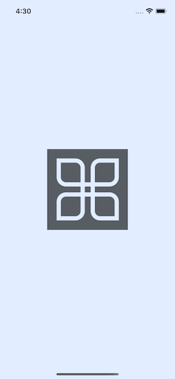
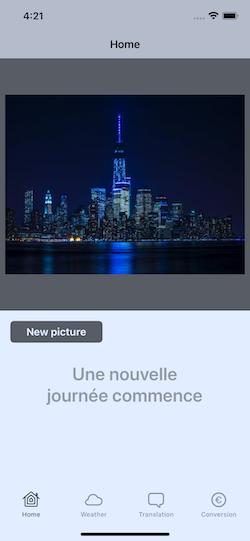
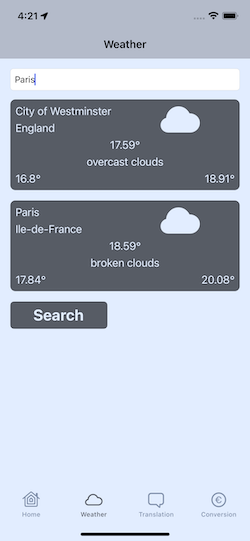
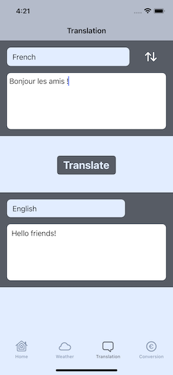
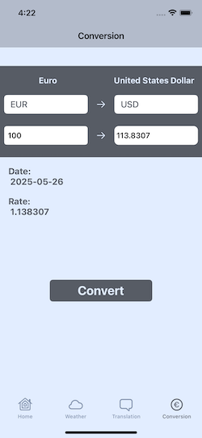

# 📱 Souvenir  
A Travel Companion App

**Souvenir** is one of my first iOS applications built from a technical specification.  
It features a clean UI organized into four main sections, each managed by its own `UINavigationController` and accessible via a `UITabBarController`.

## ✨ Features

- **Home**  
  A welcoming screen with a calming travel image and a motivational quote to inspire relaxation.

- **Weather**  
  Uses geolocation to display the weather for the current location, with the ability to search weather data for other cities.

- **Translation**  
  A simple interface to translate between French and English, using the DeepL API.

- **Currency Conversion**  
  Convert currencies (default: EUR to USD) using real-time exchange rates and display the date of the latest update.

---

## 🛠 Technologies

- Swift
- UIKit (Storyboard-based)
- MVC architecture
- CLLocationManager
- XCTest (100% model test coverage)

---

## 🚀 Getting Started

### 1. Clone the Repository

```bash
git clone https://github.com/SchenaNicolas-Pro/Souvenir
```

### 2. API Keys Configuration
This project uses third-party APIs that require authentication keys:

- [DeepL](https://www.deepl.com)  
- [API Ninjas](https://www.api-ninjas.com)  
- [Fixer](https://fixer.io)  
- [OpenWeather](https://openweathermap.org)  

### 3. Set Up the Environment
Duplicate the file `Secrets.example.xcconfig` and rename it to `Secrets.xcconfig`.  
Add your API keys in the following format:

    NINJAS_API_KEY = your_ninjas_key  
    FIXER_API_KEY = your_fixer_key  
    OPENWEATHER_API_KEY = your_openweather_key  
    DEEPL_API_KEY = your_deepl_key  

➡️ Make sure Secrets.xcconfig is excluded from version control (.gitignore) to keep your keys safe.  

## 📸 Screenshots
| LaunchScreen | Home | CLLocation |
|--------------|------|------------|
|  |  |  |

| Weather | Translation | Conversion |
|---------|-------------|------------|
|  |  |  |

## 📚 Notes  
This project was originally developed as part of a training program.  
While it may not reflect my current skill level, it demonstrates the evolution of my understanding and development skills over time.

## 👤 About Me
My name is Nicolas Schena, an iOS developer with a strong interest in challenges and creative problem-solving.  
"Souvenir" was one of my first projects, where I learned how to bring together APIs, CoreLocation, and UI components to build a complete app.  
Today, I’m continuing to grow by exploring more advanced architectures and modern frameworks like SwiftUI and Combine.  
  
## 🔗 Connect
- [LinkedIn](https://www.linkedin.com/in/nicolas-schena-413056155/)
- [Other Projects](https://github.com/SchenaNicolas-Pro)
